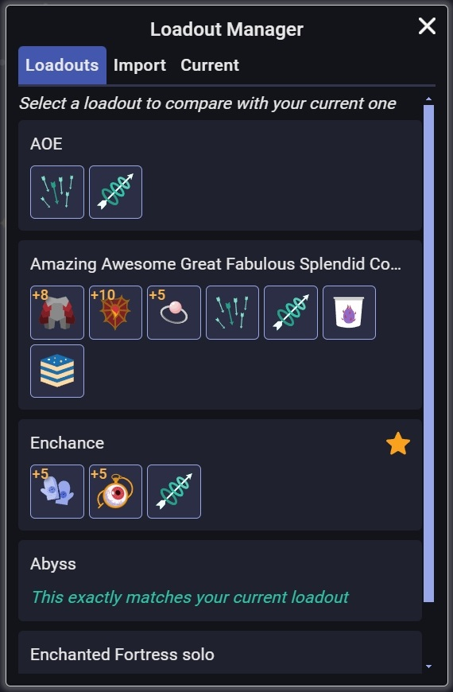
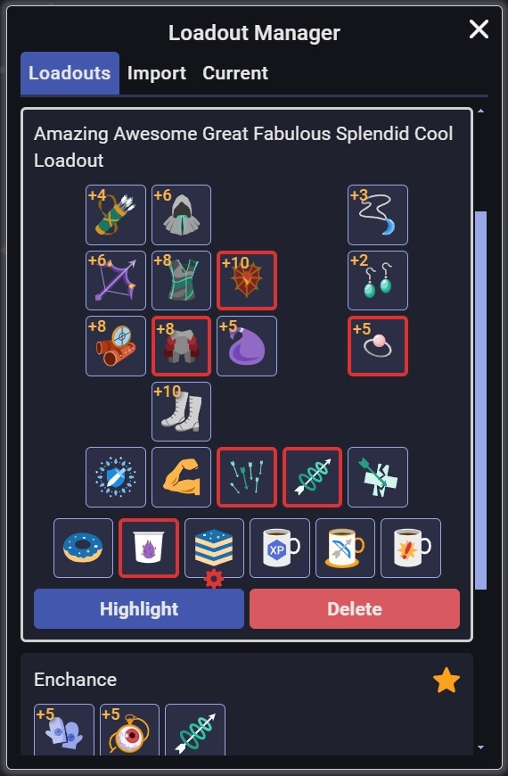
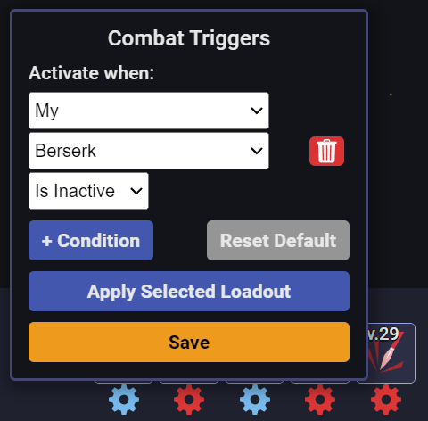
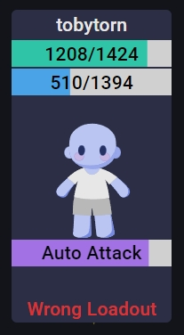

# MWI Loadout Manager

This userscript lets you import loadouts from the Combat Simulator export files and highlights equipments, abilities and consumables that are different from your selected loadout.

## Screenshots

### Manage Saved Loadouts

### Easily Change Your Current Loadout

### Receive Warning for Wrong Loadout

